# PostgreSQL Schema — Multi-Tenant SaaS POS + Inventory

Production-grade schema for multi-vertical POS (see `business_types` lookup).
Business type is classification/onboarding only; features use `business_configs.config_json`.
All SQL files live in `schema/` and install via `000_install.sql`.

---

## ERD Summary

```mermaid
erDiagram
    business_types ||--o{ businesses : classifies
    businesses ||--|| business_configs : has
    businesses ||--o{ branches : has
    businesses ||--o{ users : has
    businesses ||--o{ roles : has
    businesses ||--o{ categories : has
    businesses ||--o{ products : has
    businesses ||--o{ suppliers : has
    businesses ||--o{ customers : has
    businesses ||--o{ chart_of_accounts : has

    permissions ||--o{ role_permissions : grants
    roles ||--o{ role_permissions : includes
    roles ||--o{ user_roles : assigned
    users ||--o{ user_roles : has

    categories ||--o{ categories : parent
    categories ||--o{ products : contains
    brands ||--o{ products : brands
    units ||--o{ products : measures
    units ||--o{ unit_conversions : converts
    products ||--o{ product_variations : has
    products ||--o{ product_locations : stocked_at
    products ||--o{ barcodes : scanned_by
    products ||--o{ bom_headers : recipe_for
    price_lists ||--o{ price_list_items : prices

    branches ||--o{ product_locations : stocks
    branches ||--o{ stock_movements : ledger
    branches ||--o{ sales : sells
    branches ||--o{ cash_registers : registers

    stock_movements }o--|| products : moves
    stock_movements }o--o| purchase_lines : fifo_layer

    suppliers ||--o{ purchase_orders : supplies
    purchase_orders ||--o{ purchase_lines : lines
    purchase_orders ||--o{ purchase_receipts : received
    purchase_receipts ||--o{ purchase_receipt_lines : details

    stock_adjustments ||--o{ stock_adjustment_lines : lines
    stock_transfers ||--o{ stock_transfer_lines : lines
    waste_entries ||--o{ waste_entry_lines : lines

    bom_headers ||--o{ bom_lines : ingredients
    bom_headers ||--o{ production_orders : produces
    production_orders ||--o{ production_lines : consumes

    customers ||--o{ customer_ledger : balance
    customers ||--o{ sales : buys
    sales ||--o{ sale_lines : items
    sales ||--o{ sale_payments : paid_by
    sales ||--o{ kot_orders : kitchen
    sale_returns ||--o{ sale_return_lines : items
    sale_returns ||--o{ sale_return_payments : refunds

    floor_plans ||--o{ tables : layout
    tables ||--o{ sales : dine_in
    modifier_groups ||--o{ modifiers : contains
    kot_orders ||--o{ kot_order_lines : items

    expense_categories ||--o{ expenses : classifies
    expenses ||--o{ expense_payments : paid
    suppliers ||--o{ supplier_ledger : balance

    cash_registers ||--o{ register_shifts : shifts
    register_shifts ||--o{ register_transactions : cash_flow
    register_shifts ||--o{ sales : during

    journal_entries ||--o{ journal_lines : posts
    chart_of_accounts ||--o{ journal_lines : account

    businesses ||--o{ app_settings : configures
    businesses ||--o{ notification_log : alerts
    businesses ||--o{ audit_logs : audits
```



---

## Denormalization Recommendations

| Cache | Location | Refresh Strategy |
|-------|----------|------------------|
| **On-hand quantity** | `mv_stock_balances` | `REFRESH MATERIALIZED VIEW CONCURRENTLY` after sync batch or every 5 min |
| **FIFO COGS at sale** | `sale_lines.cost_per_unit` | Write-once at sale completion |
| **Shift cash totals** | `register_shifts.expected_cash`, `cash_difference` | Recompute on shift close |
| **Customer balance** | Optional `customers.balance_cache` (add later) | Trigger on `customer_ledger` insert |
| **Supplier balance** | Optional `suppliers.balance_cache` (add later) | Trigger on `supplier_ledger` insert |
| **Daily sales summary** | `mv_daily_sales_by_branch` (add later) | Nightly cron |
| **Low stock flags** | `notification_log` | Event-driven on movement post |

**Never denormalize:** sale totals, PO totals, journal debits/credits — always compute from lines.

**Materialized views to add in Phase 2:**
- `mv_daily_sales_by_branch` — `(business_id, branch_id, sale_date, payment_method, total)`
- `mv_product_velocity` — sales qty last 30/90 days for reorder
- `mv_expiry_risk` — products expiring within N days from `purchase_lines.expiry_date`

---

## Sync Strategy

### Master data (sync DOWN: server → device)

Pull on login and periodic background refresh. Server wins on conflict.

| Tables |
|--------|
| `businesses`, `business_configs`, `branches` |
| `users`, `roles`, `role_permissions`, `user_roles` |
| `permissions` (global seed) |
| `categories`, `brands`, `units`, `unit_conversions` |
| `products`, `product_variations`, `product_locations`, `barcodes` |
| `price_lists`, `price_list_items` |
| `tax_rates`, `discount_schemes` |
| `suppliers`, `customers` |
| `bom_headers`, `bom_lines` |
| `floor_plans`, `tables`, `modifier_groups`, `modifiers`, `product_modifier_groups` |
| `expense_categories`, `chart_of_accounts` |
| `cash_registers`, `app_settings` |

**Conflict resolution:** Last-write-wins using `updated_at` + server authority. Soft-deleted rows (`deleted_at IS NOT NULL`) propagate as tombstones.

### Transactional data (sync UP: device → server)

Push immediately when online; queue when offline. Idempotency via `(business_id, local_id)`.

| Tables |
|--------|
| `stock_movements` (append-only — never update) |
| `sales`, `sale_lines`, `sale_payments` |
| `sale_returns`, `sale_return_lines`, `sale_return_payments` |
| `purchase_orders`, `purchase_lines`, `purchase_receipts`, `purchase_receipt_lines` |
| `stock_adjustments`, `stock_adjustment_lines` |
| `stock_transfers`, `stock_transfer_lines` |
| `waste_entries`, `waste_entry_lines` |
| `production_orders`, `production_lines` |
| `kot_orders`, `kot_order_lines` |
| `expenses`, `expense_payments` |
| `register_shifts`, `register_transactions` |
| `customer_ledger`, `supplier_ledger` |
| `journal_entries`, `journal_lines` |

**Conflict resolution:**

| Scenario | Strategy |
|----------|----------|
| Duplicate `local_id` | Server returns existing record (idempotent replay) |
| Sale number collision | Server reassigns sequence; return mapped `server_id` |
| Stock movement conflict | **Append-only** — never merge; reject if would cause negative stock (unless `allow_negative_stock`) |
| Shift already closed | Reject with conflict flag; operator resolves manually |
| Master data edited on two devices | Server `updated_at` wins; client marks `sync_status = conflict` |

### Sync column usage

```text
local_id   → Client-generated UUID at create time (required for offline creates)
server_id  → Set by server after first successful sync (often equals id)
sync_status → pending | synced | conflict
```

### Post-sync actions

1. `REFRESH MATERIALIZED VIEW CONCURRENTLY mv_stock_balances`
2. Evaluate low-stock / expiry rules → insert `notification_log`
3. Post accounting journal entries (when module enabled)

---

## Stock Movement Mapping

| Event | movement_type | qty sign | reference_type |
|-------|---------------|----------|----------------|
| Opening stock | `opening` | + | `opening_balance` |
| GRN received | `purchase` | + | `purchase_receipt_line` |
| Sale completed | `sale` | − | `sale_line` |
| Customer return | `sale_return` | + | `sale_return_line` |
| Supplier return | `purchase_return` | − | `purchase_return_line` |
| Adjustment + | `adjustment_in` | + | `stock_adjustment_line` |
| Adjustment − | `adjustment_out` | − | `stock_adjustment_line` |
| Transfer send | `transfer_out` | − | `stock_transfer_line` |
| Transfer receive | `transfer_in` | + | `stock_transfer_line` |
| Production output | `production_in` | + | `production_order` |
| Production consume | `production_out` | − | `production_line` |
| Waste/spoilage | `waste` | − | `waste_entry_line` |

**FIFO flow:** On `sale` movement, application selects oldest `purchase_lines` where `qty_remaining > 0`, decrements `qty_remaining`, sets `stock_movements.purchase_line_id`.

---

## Table Count: 58 tables

See individual SQL files for full `CREATE TABLE` + index definitions.
